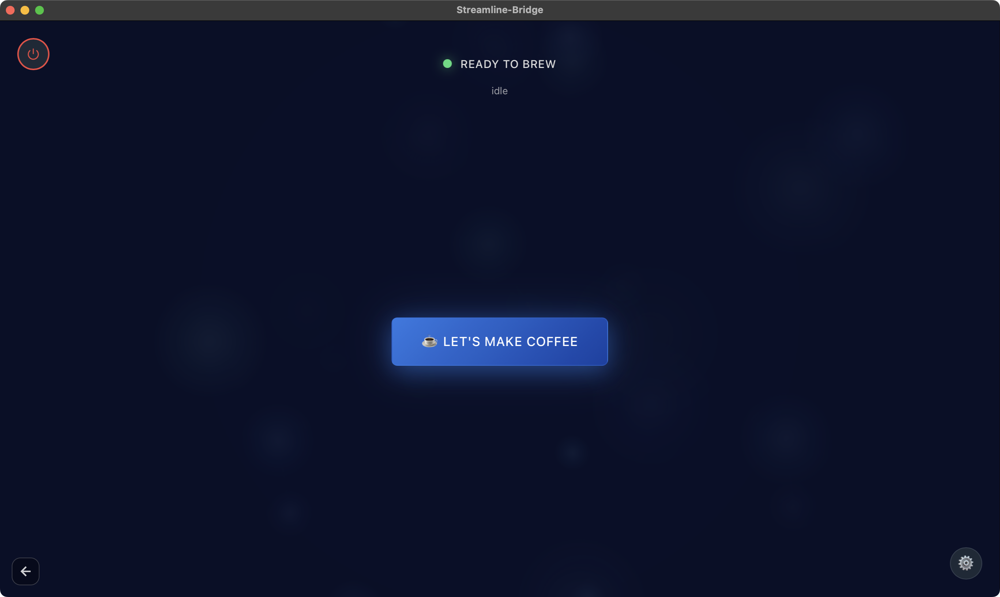
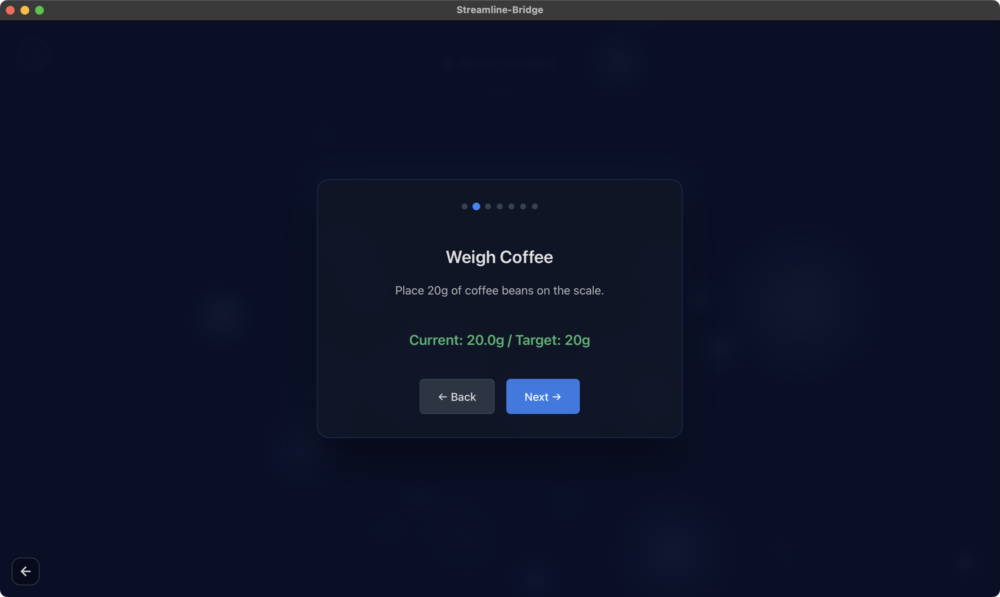
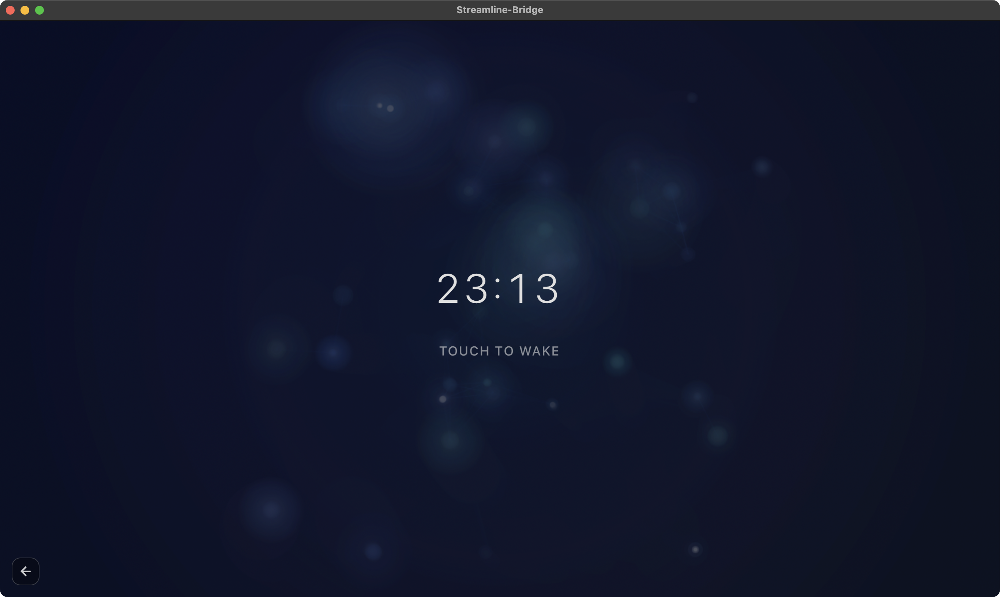

# Baseline.js

A clean and intuitive interface for [Streamline-Bridge](https://github.com/tadelv/reaprime), designed to make your espresso brewing experience as smooth and hassle-free as possible.



## Overview

Baseline.js is a reference implementation that showcases how to build a modern, user-friendly skin for Streamline-Bridge. It provides a streamlined workflow that guides users through the entire coffee-making process with beautiful visual feedback and real-time machine monitoring.

## Features

- **Real-time Machine Monitoring** - Live connection status and machine state updates
- **Guided Brewing Workflow** - Step-by-step carousel that walks you through the entire process
- **Scale Integration** - Automatic scale detection and real-time weight monitoring during preparation



- **Live Brewing Visualization** - Dynamic, data-driven visual feedback showing pressure, flow, and brew time
- **Sleep Mode** - Elegant sleep screen with customizable clock display (12/24 hour)



- **Profile Management** - Easy profile selection and configuration
- **Responsive Design** - Works beautifully on displays of all sizes
- **Beautiful Animations** - Smooth, ambient particle effects and transitions

## Quick Start

### Prerequisites

- Node.js 18+ and npm
- [Streamline-Bridge](https://github.com/tadelv/reaprime) running on your network
- An espresso machine compatible with Streamline-Bridge

### Installation

1. Clone the repository:
```bash
git clone https://github.com/yourusername/baseline.git
cd baseline
```

2. Install dependencies:
```bash
npm install
```

3. Run the development server:
```bash
npm run dev
```

4. Open [http://localhost:3000](http://localhost:3000) in your browser.

### Configuration

On first launch, click the settings icon (⚙️) to configure:

- **Server URL** - The address of your Streamline-Bridge instance (default: `http://localhost:8080`)
- **Machine Profile** - Select your espresso machine's brewing profile
- **Coffee Weight** - Default weight in grams (default: 20g)
- **Grinder Setting** - Your preferred grind setting
- **Clock Format** - Choose between 12-hour or 24-hour display

Settings are saved locally in your browser.

## Brewing Workflow

1. **Machine Ready** - Ensure your machine is warmed up and ready (green status indicator)
2. **Start Brewing** - Tap "Let's Make Coffee" to begin
3. **Follow the Steps**:
   - Turn on and connect your scale
   - Weigh your coffee beans (with live weight display)
   - Set your grinder to the configured setting
   - Grind the coffee
   - Tamp the grounds
   - Insert the portafilter
   - Place your cup
4. **Watch the Magic** - Real-time visualization of pressure, flow, and brew time
5. **Enjoy** - Your espresso is ready!

## Development

### Project Structure

```
baseline/
├── app/
│   ├── layout.tsx        # Root layout
│   └── page.tsx          # Main application (embedded HTML/JS)
├── components/
│   └── ui/               # Reusable UI components
├── screens/              # Screenshot assets
├── package.json          # Dependencies
└── README.md
```

### Build for Production

```bash
npm run build
```

The production build will be created in the `.next` directory.

### Export Static Site

```bash
npm run build
```

The static site will be available in the `out` directory (if configured).

## API Integration

Baseline.js communicates with Streamline-Bridge through its REST API and WebSocket endpoints:

- **REST API** - Machine state, profiles, device management
- **WebSocket** - Real-time machine snapshots (pressure, flow, temperature)
- **Scale WebSocket** - Live weight readings during preparation

For detailed API documentation, see the [Streamline-Bridge repository](https://github.com/tadelv/reaprime).

## Technology Stack

- **Next.js 16** - React framework with App Router
- **React 19** - UI framework
- **TypeScript** - Type-safe development
- **Tailwind CSS 4** - Utility-first styling
- **Radix UI** - Accessible component primitives
- **Canvas API** - Custom visualizations and animations

## Screenshots

| Idle State | Scale Integration | Sleep Mode |
|------------|-------------------|------------|
|  |  |  |

## Contributing

Baseline.js is a reference project to help developers understand how to build custom interfaces for Streamline-Bridge. Feel free to use it as a starting point for your own skins!

## License

Copyright (c) 2026 Decent Espresso. Licensed under [GPL v3](https://www.gnu.org/licenses/gpl-3.0.html#license-text).

## Acknowledgments

- Built for [Streamline-Bridge](https://github.com/tadelv/reaprime)
- Created with [v0](https://v0.dev) by Vercel

## Support

For issues related to:
- **Baseline.js** - Open an issue in this repository
- **Streamline-Bridge** - See the [Streamline-Bridge repository](https://github.com/tadelv/reaprime)

---

Made with ☕ for coffee lovers everywhere
